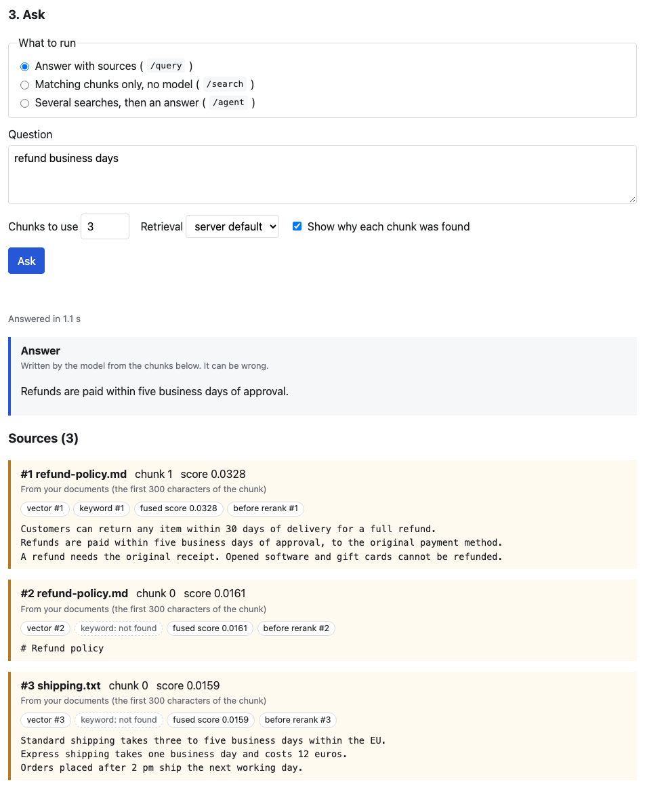

# Playground

A page for trying ragbridge on your own files and **seeing what retrieval did**: which
chunks were found, how they scored, which search found them, and what `/agent` searched
for. It is a development and demonstration tool. The product is still the HTTP API, and
nothing here changes it. Why it exists, and why it is built this way:
[ADR 0009](adr/0009-playground-as-a-static-page-served-by-the-app.md) and
[the plan](plans/phase-6-ui.md).

## Opening it

| How you run ragbridge | Address |
|---|---|
| `docker compose up` | <http://localhost:8000/playground/> |
| `uv run uvicorn ragbridge.main:app --reload` | <http://localhost:8000/playground/> |
| `docker-compose.prod.yml` | **off** (`/playground` is 404) |

`ENABLE_PLAYGROUND` switches it (default `true`). The production Compose file sets it to
`false`, and it overrides `.env.prod`. On a public server, leave it off: it holds no key
and reads no data until someone pastes a key into it, but it is a development tool and an
unneeded page. To turn it on anyway, change that line in `docker-compose.prod.yml`.

## Using it

1. **Key.** Create a **test tenant** and paste its key:
   `uv run ragbridge-admin create-tenant --name playground`. The page checks the key by
   using it, keeps it for this browser tab only, and afterwards shows only its first
   characters. The page cannot create keys or tenants, on purpose.
2. **Documents.** Choose `.txt`, `.md` or `.pdf` files (up to 10 MB each). Each gets a
   result line: ready, already uploaded (same content), queued for the background worker,
   or the server's error. The table shows each document's status and refreshes itself
   while one is still being processed.
3. **Ask.** Pick what to run:
   - **`/query`**: an answer, with its sources.
   - **`/search`**: the matching chunks only, whole, with no model involved. It is fast, and
     the best way to see retrieval by itself.
   - **`/agent`**: several searches, then an answer. The searches it ran are listed first.

## Reading the retrieval detail

Leave *Show why each chunk was found* on (it sends `"explain": true`, see
[the API guide](api.md#see-why-a-chunk-was-found)).
Each source shows:

| Badge | Meaning |
|---|---|
| `vector #2` | The chunk was 2nd in the vector (meaning-based) search |
| `keyword #1` | The chunk was 1st in the keyword (full-text) search |
| `keyword: not found` (dashed) | The keyword search did not find this chunk at all |
| `fused score` | The score after merging both searches, before reranking |
| `before rerank #3` | The chunk's position before the reranker ran. Equal to its final position when reranking is off (the default) |

**A useful thing to know.** The keyword search first runs your query as typed, so **every**
word has to appear in one chunk, which is what makes an exact term such as an error code
findable. Only if that finds nothing does it retry as an OR of the words, ranked by how many
of them a chunk holds. A quoted phrase and `-word` are never relaxed. Try `/search` with
`docker container orchestration` where "orchestration" is in no document: the keyword
badges still appear, from the retry.

`/agent` shows no per-chunk detail: it merges chunks found by several searches, so "rank
in the vector search" has no single meaning there. It shows the searches instead. With a
small corpus one search often finds everything, and the agent correctly stops after one.

## Security

- **Text from documents and models is untrusted.** Every such string is put on the page
  with `textContent`, so markup in a chunk is displayed as the characters it is. It is also
  shown in labelled blocks that look different from the interface: what *a model wrote* and
  what *a document said* are never presented as the page's own words.
- **A strict Content-Security-Policy** (everything from this origin, no inline script or
  style) is a second, independent layer. Checked: with the page deliberately changed to
  build markup from text, two elements were injected and only the CSP stopped the script.
- **Prompt injection is not solved by a page.** A document that says "ignore your
  instructions" can steer an answer, through the API as well. In one run the model obeyed
  such a line and in another it did not. The page shows the chunk that said it.
- **The key is in `sessionStorage`**, readable by any script on this origin. That is why
  the policy above exists, and why you should use a test tenant's key, not a real one.
- **No CORS.** The page is served by the app, so the browser calls the API on its own
  origin.

## What is tested, and what is not

The JavaScript is **not executed in CI**; adding a browser to CI was rejected as too
heavy for a page that is off in production. `tests/test_playground.py` checks, as plain
text and HTTP: the page is served (and absent when disabled) with the security headers on
every file, path traversal is refused, no CORS headers appear, the HTML has no inline
script, event handler or style, every id the script looks up exists, and the script never
builds markup from text.

**So a broken button can reach `main` with green CI.** This checklist was run by hand in
headless Chrome (Chrome only; Firefox and Safari were not tried) against a scratch
database, real Ollama models and a real worker. Run it again after changing the page:

- [ ] A wrong key shows "rejected" and reveals nothing else.
- [ ] The right key shows the documents and the ask form; the input is cleared and only the
      key prefix is shown.
- [ ] Reloading the page keeps you signed in; *Forget key* signs out and clears it.
- [ ] Uploading `.txt`, `.md` and `.pdf` files each gives a result line and a table row.
- [ ] Uploading the same content twice says "already uploaded".
- [ ] An unsupported extension (for example `.docx`) is refused before upload.
- [ ] A file over `ASYNC_PROCESSING_THRESHOLD` (100 KB by default) shows `pending`, then
      turns `ready` **without reloading** (needs the worker running).
- [ ] Delete removes a document after a confirmation.
- [ ] `/query` shows an answer and sources with badges; unticking *Show why...* removes
      the badges.
- [ ] `/search` shows whole chunks, the timing, and how many candidates retrieval found.
- [ ] `/agent` lists the searches it ran and then the answer.
- [ ] Switching endpoint shows only that endpoint's options.
- [ ] An error from the server (for example *Chunks to use* above 20, after removing the
      field's `max`) is shown as text.
- [ ] A document containing `` and a `<script>`
      tag, when retrieved, is shown as literal text: no element appears and the page title
      does not change.
- [ ] The browser console shows no errors.

**Not verified:** Firefox and Safari; Windows and Linux file-type behaviour (the page
states the content type from the file extension in case the system reports none for
Markdown, which did not happen on macOS Chrome); narrow, phone-sized windows.

## Not in scope

Tenant and key management, conversations (every call is independent; the page does not
send earlier questions back), streaming answers, changing settings, editing or viewing a
whole document, and any styling framework. See the plan's *Not in scope* list before
adding to the page.
